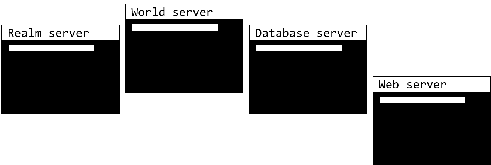

What is a private WoW server?

-   A private WoW server is a few applications or programs that work together in order to enable you to run World of Warcraft without the need for a paid subscription or internet connection if you want.
-   Server-content is produced and managed ideally which means it can be lacking, missing and buggy in some cases. You can help to make it work better but more on that later.

How does a WoW server work?

-   A WoW server generally use four applications; a **realm** server, **world** server, **database** server and optionally a **web** server.

-   The **realm** server is responsible for handling user connections to the world server.
    -   The **world** server is the brain that’s making every in-game event happen.
    -   The **database** server is the memory or save-file for the world server. It stores information such as your characters, items, creature loot tables and spawn points.
    -   The **web** server hosts a website where players can get an overview of the other three servers as well as other nice-to-know information.
