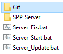
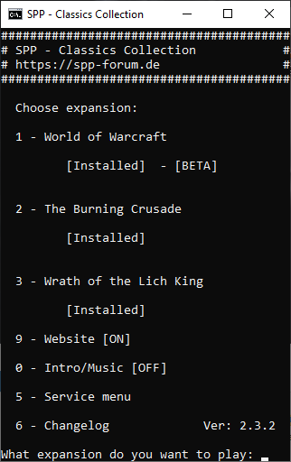
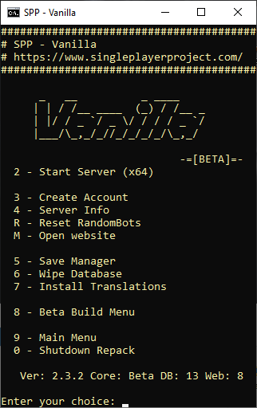
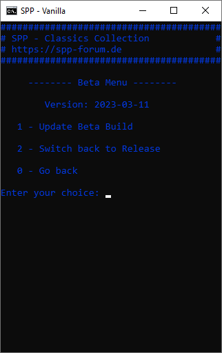

# Server setup

In this section we’ll talk about what you need to run your own server and we assume you got a grasp over basic knowledge like what a router is and hardware components such as CPU and RAM.

## System requirements

A private server can be run on your own computer, a computer on your local network or on a remote computer. I (the author) haven’t found any hard specifications but servers will run alright even with a 10 year old CPU. RAM however will need to be proportional to your player count (or bot count). As a start I recommend no less than 8GB memory and a intel i3 4th gen CPU or better. (But you can definitely run it with worse hardware)

## Software

When you got your hardware you’ll need the software (the four apps) which you can find in the links section. **Installation instructions** are provided on the target website. You’ll be downloading a [CMaNGOS](https://cmangos.net/)-server which has a few tweaks to it and a simple yet extensive boot-menu. The package or *repack* includes WoW Vanilla, TBC and WotLK. See a list of features [here](https://singleplayerproject.com/viewtopic.php?f=4&t=373).

## Starting the server

Once you have installed the repack you’ll be facing three start-scripts which does what they say in the title.

-   **Server_fix.bat** can fix some errors you may encounter, the SPP
-   **Server_Start.bat** will start the *SPP Classics Collection-menu*
-   **Server_update.bat** will update the software if there’s a new release available on [Github](https://github.com/celguar/spp-classics-cmangos/releases). (read about releases and beta versions here)

## The SPP Classics-menu

The SPP Classics Collection-menu is what you’ll be using to install, run and shutdown the server software. You navigate the menu with numbers or letters.

First you encounter a grey colored menu where you can choose to install a certain game version to host for your players, the webserver can also be controlled from this menu.

After selection of game version you’ll meet a colored menu with information of which game version that’s currently being managed. At the bottom of this menu you’ll also find information useful for troubleshooting, namely: **Core version**, **Database version**, **Webserver version**.

## Beta vs release

When you have the colored menu open (ie. Vanilla) but without having the server app running you may switch to a beta build through the **Beta Build Menu**.

Releases are the more official versions of the repack and while being generally stable they are few and far between. The beta versions see more frequent updates but can run into unexpected issues that may for example cause the server to shut down itself. I recommend using the beta as the most annoying bugs are fixed fairly quickly but you do **have to switch back to release version every now and then** to get the core updates.

Easiest way of keeping track on when you have to update your release version is joining the **Mangosbots discord** (of which I don’t have a permalink right now so better ask for a link in SPP-discord).

