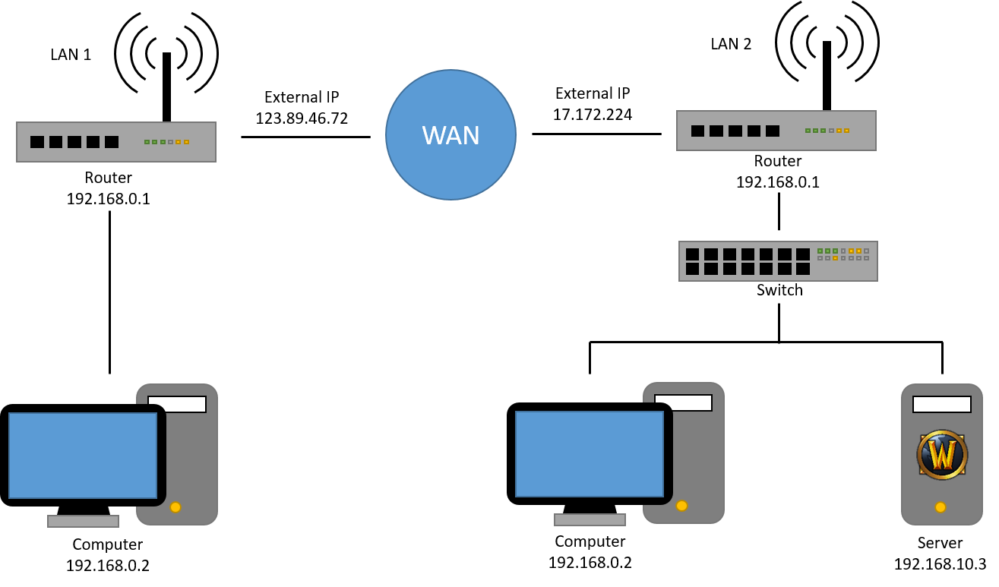

# WAN setup

WAN setup means you run server on an entirely different network than the one your client is connected to, just as how it is when Blizzard hosts the server. For this to work the following changes will need to be made to the configuration:
