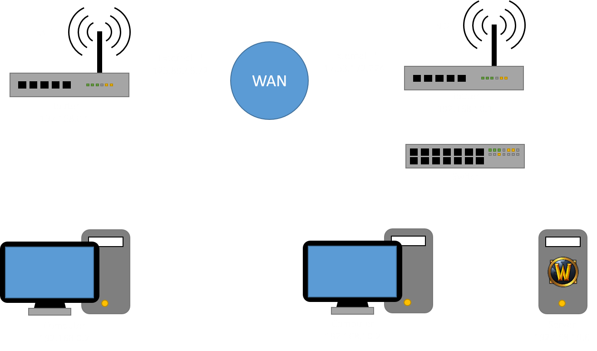
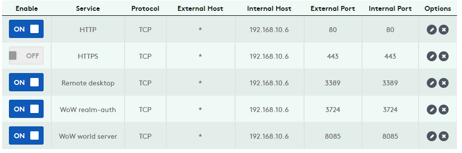
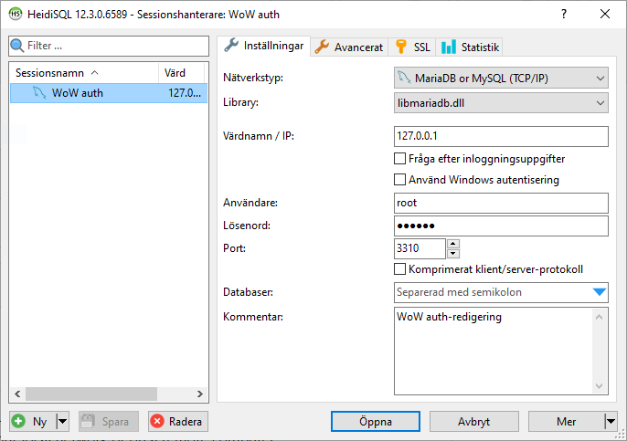
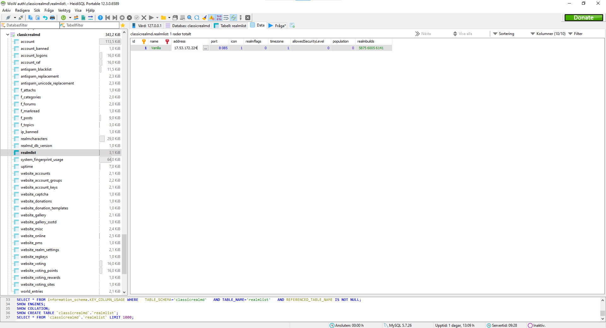

# Remote setup
Remote setup means you run server on an entirely different network than the one your client is connected to, just like how official servers function.

## Router
The client on LAN 1 need to find the server on LAN 2. To make this happen you need to *forward* two dataports. This means you have to manually tell your **router** where to send incoming connections. Port **3724** and **8085** will need to be *forwarded* to the **local IP-adress** of the server. Optionally if you have a webserver you will also have to forward port **80**. (see image below)

## Database
The server also need to know the external IP to which clients are connecting to. For this you have to edit the database. Use a SQL-Editor like HeidiSQL to do this. (See [links](Links))

1. Start the WoW-server script and go to the second colored menu (i.e WotLK menu).
2. Start HeidiSQL and log in.
- Username: root
- Password: 123456
- Port: 3310

4. Find the realmlist table and edit the data (note that you need to edit the correct field in the correct tab).

5. All done! Don't forget to set up the client(s) with the right realmlist.wtf in [Client Setup](ClientSetup) 
